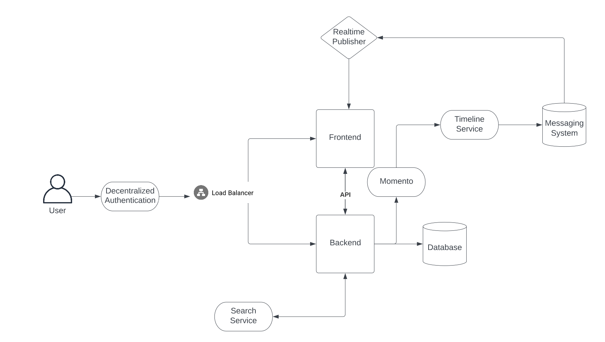

# Week 0 — Billing and Architecture

#### Homework Hard Assignments

* ~~Set a Billing alarm~~ - **Done** - Email notification when bill exceeds 50%, 75%, and 100%.
* ~~Set a AWS Budget~~ - **Done** - Budget of $10.
* ~~Generating AWS Credentials~~ - **Done** - Created IAM account, created IAM group with Admin policy. Created policy to allow IAM user to manage their own MFA device and to prevent any activity without being signed in with MFA. Enabled MFA on both IAM account and root account.
* ~~Using CloudShell~~ - **Done** - Played with cloudshell, installed AWS CLI V2 and configured a default profile.
* ~~Conceptual Architecture Diagram or your Napkins~~ - **Done** - Just duplicated the one in class.
* 

#### Homework Stretch Assignments

* ~~Destroy your root account credentials, Set MFA, IAM role~~ - **Done** - Also using temp credentials through MFA with a session token.
* ~~Use EventBridge to hookup Health Dashboard to SNS and send notification when there is a service health issue~~. - **Done** - Created Evenbridge for all services under aws.health and created an SNS topic to send an email.
* ~~Review all the questions of each pillars in the Well Architected Tool (No specialized lens)~~ - **Done** - Lot of questions for each section. Most seem useful.
* Create an architectural diagram (to the best of your ability) the CI/CD logical pipeline in Lucid Charts
* ~~Research the technical and service limits of specific services and how they could impact the technical path for technical flexibility.~~ - **Done** - I reviewed the list of limits (https://docs.aws.amazon.com/general/latest/gr/aws-service-information.html) and knew about some of them. Route53, IAM, and WorkSpaces.
* ~~Open a support ticket and request a service limit.~~ - **Done** - I'm considering this done. I didn't open a support ticket, but have opened support tickets in the past for billing and account support. Almost opened a support ticket a while back for Route53 as I'm near the domain limit, but didn't as I'm not there yet.

#### Other Info

aws configure

Default profile - only used for generating temporary session tokens with MFA.

mfa profile - where session token info is stored, but rotated daily.

aws sts get-session-token --serial-number "arn:aws:iam::*MyAWSAccount#*:mfa/*XXXXXX*" --token-code *XXXXXX*

[mfa]
aws_access_key_id = example-access-key-as-in-returned-output
aws_secret_access_key = example-secret-access-key-as-in-returned-output
aws_session_token = example-session-Token-as-in-returned-output
aws_default_region = us-east-1

Health Dashboard - https://health.aws.amazon.com/health/home#/account/dashboard/open-issues

Eventbridge Pattern:

{
  "source": ["aws.health"],
  "detail-type": ["AWS Health Event"]
}
